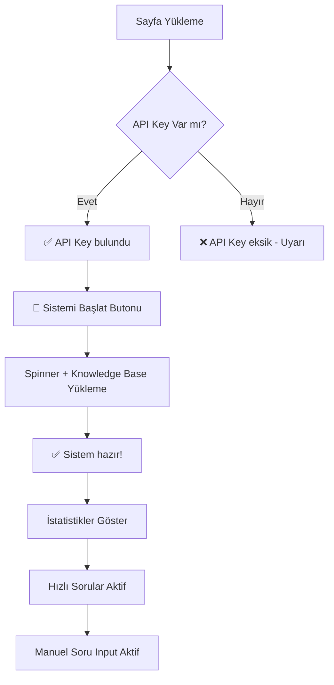

# 🏋️ RAG Personal Trainer - Product Requirements Document (PRD)

## 📋 Genel Bakış

**Proje Adı:** Kinetic AI - RAG Personal Trainer  
**Brand Name:** KINETIC ENGINE  
**Sürüm:** 2.0 (Redesigned UI)  
**Tarih:** Nisan 2026  
**Teknoloji:** HTML/CSS/Tailwind, Python Backend, OpenAI GPT-3.5-turbo, RAG Architecture  

### 🎯 Proje Amacı

Fitness, beslenme ve antrenman konularında kullanıcılara kişiselleştirilmiş, bilimsel bilgi tabanlı yanıtlar veren AI destekli web uygulaması.

### 🚀 Temel Değer Önerisi

- ✅ **RAG (Retrieval-Augmented Generation):** Yerinde bilgi tabanı ile doğru, güncel yanıtlar
- ✅ **Kişiselleştirilmiş Rehberlik:** Her seviyeye uygun fitness tavsiyeleri
- ✅ **7/24 Erişilebilir:** İstediğiniz zaman AI antrenör desteği
- ✅ **Kolay Kullanım:** Sezgisel web arayüzü, hızlı sorular sistemi

---

## 🎨 UI/UX Tasarım Gereksinimleri

### 1. Renk Paleti (Kinetic AI Theme)

#### Primary Colors (Tailwind Custom)

```css
- Primary: #006666 (Teal - Ana marka rengi)
- Primary Dim: #005959 (Koyu teal)
- Primary Fixed: #73f0ef (Açık teal)
- On Primary: #bbfffe (Teal üzerinde metin)

- Secondary: #b61321 (Kırmızı - Vurgu rengi)
- Secondary Dim: #a40018 (Koyu kırmızı)
- Error: #b31b25 (Hata rengi)
```

#### Surface & Background Colors

```css
- Background: #f4f6fa (Ana arka plan)
- Surface: #f4f6fa (Yüzey rengi)
- Surface Bright: #f4f6fa
- Surface Container: #e5e8ed
- Surface Container Low: #eef1f5 (Sidebar bg)
- Surface Container Lowest: #ffffff (Kart bg)
- Surface Container High: #dfe3e8
- Surface Container Highest: #d9dde3
```

#### Text & Outline Colors

```css
- On Surface: #2c2f32 (Ana metin)
- On Surface Variant: #595c5f (İkincil metin)
- Outline: #74777b (Kenarlıklar)
- Outline Variant: #abadb1 (Hafif kenarlık)
```

#### Gradient & Special

```css
- Kinetic Gradient: linear-gradient(to right, #b61321, #006666)
  (Logo ve başlıklarda kullanılır)
- Ghost Border: 1.5px solid rgba(0, 102, 102, 0.15)
  (Quick action cards)
```

#### Quick Action Cards

```css
- Arka Plan: #ffffff (surface-container-lowest)
- Border: Ghost border (1.5px rgba primary)
- Hover Shadow: 0 25px 50px -12px rgba(0,102,102,0.05)
- Border Radius: 0.75rem (12px)
- Padding: 2rem (32px)
- Icon Color: #006666 → #b61321 (hover)
- Active Scale: 0.98
```

#### Floating Input Bar

```css
- Background: #ffffff (surface-container-lowest)
- Border: 1px solid rgba(0,102,102,0.1)
- Border Radius: 9999px (full)
- Shadow: 0 25px 50px -12px rgba(0,102,102,0.1)
- Button Background: #006666 (primary)
- Button Hover: #005959 (primary-dim)
```

### 2. Tipografi (Lexend + Inter System)

```css
Font Families:
- Headline: 'Lexend' (Logo, başlıklar, butonlar, nav)
- Body: 'Inter' (Paragraflar, input)
- Label: 'Inter' (Küçük metinler, caption)

Boyutlar:
- Hero Title (H1): 6xl (text-6xl: 3.75rem/60px), font-black
  Mobile: 7xl (text-7xl: 4.5rem/72px)
- Logo (Brand): 2xl (text-2xl: 1.5rem/24px), font-black
- Section Title: lg (text-lg: 1.125rem/18px), font-semibold
- Nav Items: sm (text-sm: 0.875rem/14px), uppercase, tracking-tight
- Sidebar Items: xs (text-xs: 0.75rem/12px), uppercase, tracking-widest
- Body Text: xl (text-xl: 1.25rem/20px), font-light
- Caption: [10px], uppercase, tracking-widest
- Button Text: sm (text-sm: 0.875rem/14px), font-bold

Special Effects:
- Gradient Text: bg-gradient-to-r from-[#b61321] to-[#006666]
  bg-clip-text text-transparent
- Tracking: tight (başlıklar), widest (uppercase labels)
- Leading: none (hero title için)
```

### 3. Layout Yapısı (Kinetic AI Design)

```
┌────────────────────────────────────────────────────────────────────────────┐
│  STICKY TOP BAR (bg-white, shadow-sm)                                     │
│  [KINETIC AI 🔥] [Performance|History|Resources]  🔔⚙️👤                  │
├──────────────┬─────────────────────────────────────────────────────────────┤
│              │                                                             │
│   SIDEBAR    │                    MAIN CONTENT                             │
│  (320px)     │                  (ml-80, flex-col)                          │
│   Fixed      │                                                             │
│              │   ┌───────────────────────────────────────────────┐        │
│ ┌──────────┐ │   │           HERO SECTION (Centered)             │        │
│ │⚡KINETIC │ │   │                                                 │        │
│ │ ENGINE   │ │   │  🏋️ RAG Personal Trainer (Gradient 6xl)       │        │
│ │[Online]  │ │   │  Your AI-powered fitness assistant...          │        │
│ └──────────┘ │   │                                                 │        │
│              │   │  ┌─────────┐ ┌─────────┐ ┌─────────┐          │        │
│ [🚀 Sistemi  │   │  │ 🏋️ Card │ │ 📅 Card │ │ 🥗 Card │ (3col)  │        │
│    Başlat]   │   │  └─────────┘ └─────────┘ └─────────┘          │        │
│              │   │  ┌─────────┐ ┌─────────┐ ┌─────────┐          │        │
│ ┌──────────┐ │   │  │ ⏱️ Card  │ │ ✏️ Card  │ │ 🔥 Card │ (3col)  │        │
│ │🎯Dashboard│ │   │  └─────────┘ └─────────┘ └─────────┘          │        │
│ │ Analytics│ │   │                                                 │        │
│ │ Config   │ │   │  Decorative blur circles (absolute, -z-10)     │        │
│ │ Clear    │ │   └───────────────────────────────────────────────┘        │
│ └──────────┘ │                                                             │
│              │                                                             │
│ ┌──────────┐ │   ┌───────────────────────────────────────────────┐        │
│ │ Session  │ │   │    FLOATING INPUT BAR (fixed bottom)           │        │
│ │ Stats    │ │   │  ┌───────────────────────────────────────┐    │        │
│ │ 12:45    │ │   │  │ [Input: rounded-full]    [Sor▶]      │    │        │
│ │ 24 Q     │ │   │  └───────────────────────────────────────┘    │        │
│ │✅CALIBR. │ │   │  Kinetic AI can make mistakes...              │        │
│ └──────────┘ │   └───────────────────────────────────────────────┘        │
│              │                                                             │
│ Support      │                                                             │
│ Logout       │                                                             │
└──────────────┴─────────────────────────────────────────────────────────────┘

Katman Hiyerarşisi:
- z-20: Sidebar (fixed left)
- z-10: Top bar (sticky)
- z-0: Main content
- z-[-10]: Decorative elements (blur circles)
- Bottom floating: Input bar (gradient fade overlay)
```

### 4. Responsive Tasarım

- **Desktop (>1024px):** Wide layout, sidebar genişletilmiş
- **Tablet (768-1024px):** Sidebar daraltılabilir
- **Mobile (<768px):** Sidebar gizli (hamburger menu)

---

## 🔧 Fonksiyonel Gereksinimler

### 1. Sistem Başlatma

**FR-001: API Key Kontrolü**

- [ ] .env dosyasından OPENAI_API_KEY yükleme
- [ ] API key varlığı kontrolü (✅/❌ göstergesi)
- [ ] Eksik key durumunda kullanıcı uyarısı

**FR-002: Knowledge Base Yükleme**

- [ ] 4 dosya yükleme (beginner_guide, cardio, nutrition, strength)
- [ ] Dosya boyutu gösterimi (karakter sayısı)
- [ ] Yükleme süresi sırasında spinner animasyonu
- [ ] Başarı/hata mesajı gösterimi

### 2. Soru Sorma Mekanizmaları

**FR-003: Hızlı Sorular**

- [ ] 6 adet önceden tanımlı soru butonu
- [ ] 3 sütunlu grid layout
- [ ] Sistem başlatılmadıysa butonlar disabled
- [ ] Tıklamada direkt AI'ya soru gönderimi
- [ ] Spinner ile yükleme göstergesi

**FR-004: Manuel Soru Girişi**

- [ ] Text area (100px yükseklik)
- [ ] Placeholder metin ile yönlendirme
- [ ] Form submit ile soru gönderimi
- [ ] Form temizleme (clear_on_submit)
- [ ] Boş soru kontrolü

### 3. AI Yanıt İşleme

**FR-005: Progress Bar Sistemi**

```
Adım 1 (25%):  📝 Soru işleniyor...
Adım 2 (50%):  🤖 AI ile iletişim kuruluyor...
Adım 3 (75%):  ✅ Yanıt hazırlanıyor...
Adım 4 (100%): ✨ Tamamlandı!
```

- [ ] 4 aşamalı görsel geri bildirim
- [ ] Her aşamada 0.5s bekleme
- [ ] Tamamlandıktan sonra progress temizleme

**FR-006: Yanıt Gösterimi**

- [ ] Styled question box (mor gradient)
- [ ] Styled answer box (beyaz + yeşil border)
- [ ] HTML rendering desteği
- [ ] Satır sonları korunmalı (pre-wrap)
- [ ] Kelime taşmaları önlenmeli (word-wrap)

### 4. Chat Geçmişi

**FR-007: Geçmiş Yönetimi**

- [ ] Session state'te liste tutma
- [ ] Ters sıralama (en yeni üstte)
- [ ] Expandable item'lar (varsayılan kapalı)
- [ ] Her item'da styled boxes
- [ ] "Geçmişi Temizle" butonu (sidebar)

### 5. Hata Yönetimi

**FR-008: Error Handling**

- [ ] API hatası yakalama
- [ ] Kullanıcı dostu hata mesajları
- [ ] Teknik detaylar (expander içinde saklanmış)
- [ ] Trainer başlatılmadıysa uyarı
- [ ] Network hatası durumunda retry önerisi

---

## 🛠️ Teknik Gereksinimler

### 1. Teknoloji Stack

```python
# Backend
- Python 3.12
- OpenAI API (GPT-3.5-turbo)
- python-dotenv 1.0.1

# Frontend
- Streamlit 1.56.0
- Custom CSS (inline)
- HTML rendering (unsafe_allow_html)

# Knowledge Base
- 4x .txt dosyaları (UTF-8)
- Total: ~24,687 karakter
- Format: Plain text
```

### 2. Dosya Yapısı

```
02-rag-personal-trainer/
├── app.py                    # Streamlit web uygulaması
├── simple_test.py            # RAG trainer sınıfı
├── rag_trainer.py           # Orijinal trainer (deprecated)
├── requirements.txt          # Python dependencies
├── .env                      # API key (gitignore)
├── PRD.md                    # Bu dokümantasyon
├── WEB_ARAYUZU.md           # Kullanım kılavuzu
├── README.md                 # Proje tanıtımı
└── knowledge_base/
    ├── beginner_guide.txt
    ├── cardio_exercises.txt
    ├── nutrition_basics.txt
    └── strength_training.txt
```

### 3. Sınıf Yapısı

```python
class SimpleRAGTrainer:
    def __init__(self, verbose=False):
        """
        OpenAI client başlat
        verbose: Console çıktısı kontrolü (default: False)
        """
    
    def load_knowledge_base(self, path="knowledge_base", verbose=False):
        """
        Knowledge base dosyalarını yükle
        - 4x .txt dosyası
        - UTF-8 encoding
        - Toplam karakter sayısı hesapla
        """
    
    def ask_question(self, question: str) -> str:
        """
        GPT-3.5-turbo ile soru-cevap
        - System prompt: Knowledge base context
        - Temperature: 0.7
        - Max tokens: 500
        - Return: AI response string
        """
```

### 4. Session State Yönetimi

```python
st.session_state = {
    'trainer': SimpleRAGTrainer instance or None,
    'loaded': Boolean (sistem hazır mı?),
    'chat_history': [
        {
            'question': str,
            'answer': str
        },
        ...
    ]
}
```

---

## 📱 User Flow

### 1. İlk Kullanım Akışı



### 2. Hızlı Soru Akışı

```
1. Kullanıcı hızlı soru butonuna tıklar
2. Spinner gösterilir ("Soru yanıtlanıyor...")
3. AI'ya soru gönderilir
4. Yanıt alınır
5. Chat history'ye eklenir
6. Styled boxes ile gösterilir
7. Success mesajı
```

### 3. Manuel Soru Akışı

```
1. Kullanıcı text area'ya soru yazar
2. "🚀 Sor" butonuna tıklar
3. Form submit edilir
4. Progress bar başlar (0% → 25% → 50% → 75% → 100%)
5. Her adımda status mesajı güncellenir
6. AI yanıtı alınır
7. Chat history'ye eklenir
8. Progress temizlenir
9. Styled boxes ile yanıt gösterilir
10. Form temizlenir (clear_on_submit)
```

---

## 🎯 Başarı Metrikleri

### 1. Performans

- [ ] Sayfa yükleme < 2 saniye
- [ ] Knowledge base yükleme < 3 saniye
- [ ] AI yanıt süresi < 5 saniye (ortalama)
- [ ] UI rendering < 100ms

### 2. Kullanılabilirlik

- [ ] %100 API başarı oranı (doğru key ile)
- [ ] Sıfır console hatası
- [ ] Mobil uyumlu responsive tasarım
- [ ] Tüm tarayıcılarda uyumlu (Chrome, Safari, Firefox)

### 3. Kullanıcı Deneyimi

- [ ] Net görsel geri bildirim (progress, spinner, success)
- [ ] Anlaşılır hata mesajları
- [ ] Kolay navigasyon (hızlı sorular + manuel input)
- [ ] Estetik, modern tasarım

---

## 📊 Örnek Senaryolar

### Senaryo 1: Yeni Başlayan Kullanıcı

**Kullanıcı:** "Bench press nasıl yapılır?"  
**Beklenen Yanıt:**

- Adım adım teknik açıklama
- Yaygın hatalar
- Güvenlik tavsiyeleri
- Kaynak: beginner_guide.txt + strength_training.txt

### Senaryo 2: İleri Seviye Kullanıcı

**Kullanıcı:** "12 haftalık hipertrofi programı öner"  
**Beklenen Yanıt:**

- Haftalık split
- Progressive overload stratejisi
- Hacim ve şiddet önerileri
- Kaynak: beginner_guide.txt + strength_training.txt

### Senaryo 3: Beslenme Sorusu

**Kullanıcı:** "Keto diyeti ile kas gelişimi mümkün mü?"  
**Beklenen Yanıt:**

- Keto prensibi
- Protein ihtiyacı
- Kalori dengesi
- Kaynak: nutrition_basics.txt

### Senaryo 4: Kardiyo Sorusu

**Kullanıcı:** "HIIT mi LISS mi daha etkili?"  
**Beklenen Yanıt:**

- Her ikisinin faydaları
- Kullanım senaryoları
- Frekans önerileri
- Kaynak: cardio_exercises.txt

---

## 🚧 Gelecek Geliştirmeler (Backlog)

### V1.1 Önerilen Özellikler

- [ ] Kullanıcı kaydı ve giriş sistemi
- [ ] Kişisel profil (yaş, kilo, hedef)
- [ ] Chat geçmişi database'de saklama
- [ ] Çoklu dil desteği (EN, TR, DE)
- [ ] Ses ile soru sorma
- [ ] Yanıtları PDF'e export
- [ ] Görsel egzersiz diyagramları

### V1.2 AI Geliştirmeleri

- [ ] GPT-4 entegrasyonu
- [ ] Fine-tuning ile özel model
- [ ] Daha büyük knowledge base (50+ döküman)
- [ ] Vektör database (Pinecone/Weaviate)
- [ ] Semantic search iyileştirmeleri

### V1.3 UI/UX İyileştirmeleri

- [ ] Dark mode
- [ ] Tema özelleştirme
- [ ] Animasyonlar (fade-in, slide)
- [ ] Skeleton loading states
- [ ] Toast notifications

---

## 📝 Dokümantasyon Checklist

- [x] PRD hazırlandı
- [x] UI tasarım renkleri tanımlandı
- [x] Layout mockup'ı oluşturuldu
- [x] User flow diyagramları çizildi
- [x] Fonksiyonel gereksinimler listelendi
- [x] Teknik stack detaylandırıldı
- [x] Başarı metrikleri belirlendi
- [ ] Wireframe çizimi (Figma)
- [ ] High-fidelity mockup (Photoshop)
- [ ] Kullanıcı test senaryoları
- [ ] API dokümantasyonu

---

## 👨‍💻 Developer Notes

### CSS Özelleştirme Notları

```css
/* Soru kutusu gradient efekti için */
background: linear-gradient(135deg, #667eea 0%, #764ba2 100%);

/* Cevap kutusuna yumuşak gölge */
box-shadow: 0 4px 6px rgba(0,0,0,0.1);

/* Responsive font için */
@media (max-width: 768px) {
    .main-header { font-size: 2rem; }
}
```

### Streamlit Performans İpuçları

- `@st.cache_data` kullan (knowledge base için)
- Session state minimal tutulmalı
- Large data için lazy loading
- Image optimizasyonu (WebP formatı)

### Güvenlik Önerileri

- API key asla commit edilmemeli (.gitignore)
- Rate limiting ekle (abuse önlemi)
- Input sanitization (XSS önlemi)
- HTTPS zorunlu tutulmalı (production)

---

**Son Güncelleme:** Nisan 2026  
**Hazırlayan:** GitHub Copilot  
**Durum:** ✅ V1.0 Tamamlandı, Production Ready  
